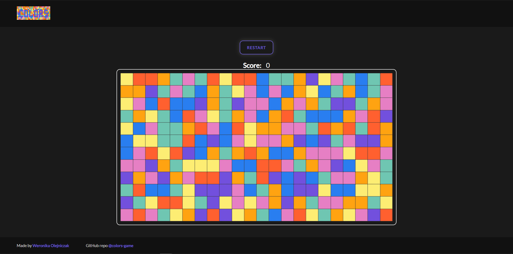

<h1 align="center">Colors Game</h1>

<h3 align="center"><a href="https://weronikaolejniczak.github.io/colors-game/" target="_blank" rel="noopener noreferrer">Live Demo</a></h3>

---

## Description

**Colors Game** is a browser game in which your task is to gain points by destroying neighboring blocks of the same color. It was implemented in **React**.

 

### Rules

- You gain points by clicking on the block that is surrounded by blocks of the same color. The block of the same color has to be to the top, bottom, right or left of the clicked block.
- You gain one point per destroyed block.
- Once you destroy some group of blocks, the filled space is taken by blocks existing to the top of them or new blocks are generated.
- You can play until you get bored or there are no groups of neighboring same-colored blocks!

  

## About the project

The project was developed as a solution to recruitment task.

 

### Problems solved

- **Constructing board**

The board is in fact a two-dimensional array, *"array of arrays"*. Each array is a column and each element of that array is a value from 1 to the number of colors.

- **Block neighborhood check**

An especially interesting problem was writing a function to check if for a given block the surrounding blocks are of the same color. This is quite straightforward but the interesting part is where some neighboring block is indeed of the same color and you now have to check *its* neighborhood, and repeat the process for each of the same-colored blocks in close proximity to one another.

What immediately comes to mind is a **recursion** function. Such a function was implemented in a form of a utility and each time the player clicks on some block, the utility is used. It returns the coordinates [x, y] in the form of an array if there are at least 2 same-colored blocks in the close proximity (one of them is the one chosen by the user). If the block that the player chose is in fact a "lonely" block (i. e. it does not have same-colored blocks in its neighborhood) the function returns an empty array.

- **Updating board**

Another interesting problem to solve was updating the game board accordingly. If we get a non-empty array of coordinates from above-mentioned utility, for each coordinate we change the value in the board to 0. Then, we filter out 0s from each column of the board (so each array stored in the board). Subsequently, for each column that is shorter than the specified Y dimension of the board, we generate new values from the length of the array to the Y dimension.

- **Rendering board**

The board was positioned using **flexbox**, so that each column is in vertical direction just as columns were designed to be.

- **State management**

The state (board, score) is managed with a **Redux** store. A middleware **redux-thunk** was used to dispatch *INCREASE_SCORE* action from *UPDATE_BOARD* action as a side-effect. Redux helped separate the business logic from UI components.

- **Styling**

The styling approach that I chose for this project is **Sass + BEM** in React. It facilitates project scaling.

 

### Future scope

- **Board examiner function.** Such an examiner would check if there are available moves on the board. If not, an appropriate message would be displayed on the board.
- Display a message on the board if the user clicks on the block which does not have same-colored neighbors.
- Let user choose the dimensions of the board.

  

## Project setup

First, you have to install the dependencies. You can do that by going to the root folder of the project and typing:

    yarn install

in the terminal.

To run the project in development mode, type:

    yarn start

in the project directory. 
Open [http://localhost:3000](http://localhost:3000) to view it in the browser. You can see the Redux store and actions dispatched in the console of Developer tools of your browser.
